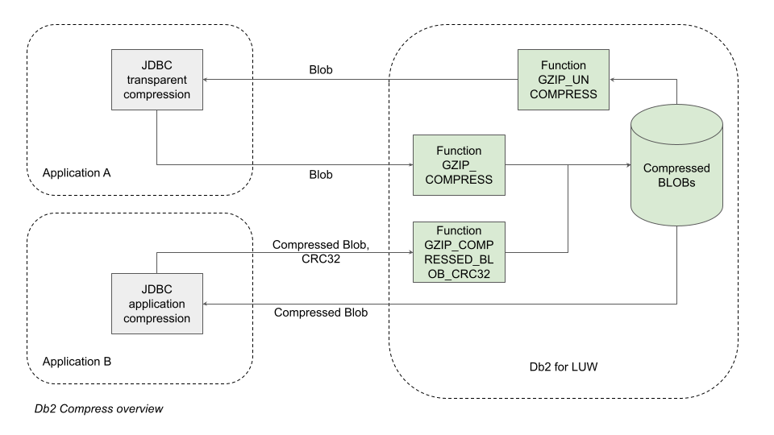

# db2-compress
Db2 for LUW UDFs for compressing and uncompressing BLOBs

## Synopsis
LOBs (_large objects_) can consume a lot of space. Db2 Adaptive Compression can compress inline LOBs, but unfortunately there is no in-built feature for compressing larger LOBs.

This project repository provides UDFs (Db2 _user defined functions_) that work with Java GZIP compression for BLOBs (_binary large objects_).

## Status
Release 0.1 was the initial release. It provided UDFs for compressing and uncompressing BLOBs within the database, transparently from the application perpective.

Release 0.2 adds CRC32 checksum functions to facilitate an alternative, better scaling architecture where the application is responsible for compressing the data. The compressed BLOB is passed along with the CRC32 checksum of the uncompressed data. The database then validates the checksum before persisting the BLOB. BLOBs can be retrieved in compressed form for uncompression by the application.

## Quick installation instructions
1. Compile the functions using the Ant XML build file.
1. Connect to your Db2 for LUW database.
1. Enter the Db2 CLP shell: ``db2 -t``
1. Change to the db2 directory contains files install_jar.sql and functions.sql.
1. Install the JAR:
    1. Copy line 2 of install_jar.sql. Edit the file URL in the first parameter to match the location of the JAR file built by the first step (must be full path).
    1. Execute the amended SQL, e.g.: ``CALL sqlj.install_jar('file:/home/jsmith/myjars/db2-compress.jar', 'UTILS.GZIPJAR');``
1. Create the functions: db2 -tf functions.sql

The functions should now be usable, e.g. ``VALUES utils.gzip_compress(CAST(REPEAT('test ', 1000) as BLOB));``

> Note: You can edit the functions before creating them, to accept and return larger BLOBs. However, read the notes below related to performance. For BLOBs larger than 64MB, you will also need to increase the JAVA_HEAP_SZ.

## Important notes
1. In edge cases, GZIP compression can result in bigger output than input. This can happen when the input data is very short, or when the data is of a type that does not compress well.
1. The sample 25MB JSON text file used for testing compresses in about half a second and uncompresses in about quarter of a second on the Dell XPS 13 laptop used for development and testing. For shorter data, execution times reduce more-or-less proportionally. For uses such as a JSON document archive (write once read seldom-if-ever) this may be adequate, depending on your requirements and design. However, it is unlikely this solution should be used in a context where response is paramount.
1. For better scaling, consider asking your developers to compress and decompress the LOB data in the application tier. This will distribute the cost across different servers:
    * If GZIP compression is used there, you still the option of using the Db2 UDFs if another need arises.
    * If CRC32 checksums are provided with the compressed BLOB, they can be used by the database to validate that the BLOBs are GZIP compressed. This validation is cheaper than compressimg the BLOB within the database.
1. JSON text achieved a compression ratio better than 6x in testing. If your compression ratio may be less than 2x in some cases, consider adding logic to your design to decide whether to store the saved object compressed or uncompressed.
1. If you are using LOBs that are NOT COMPACT (generally recommended), remember that buddy space allocation is performed by powers of 2. For example, a 65KB LOB will not fit in 64KB, so 128KB is allocated. When calculating the benefit of GZIP compression, this complicates things:
    1. For example, the space saving benefit of a reduction from 128KB to 65KB is zero.
    1. On the other hand, a reduction from 65KB to 64KB is an effective 2x space saving.

    > Note: So long as your data is of a type that will compress 2x or better, there is always a space saving and you need not worry about the effects of buddy space boundaries.
1. If building additional logic, it is recommended not to GZIP compress inline LOB data. Use Db2 adaptive compression instead for these smaller objects.
